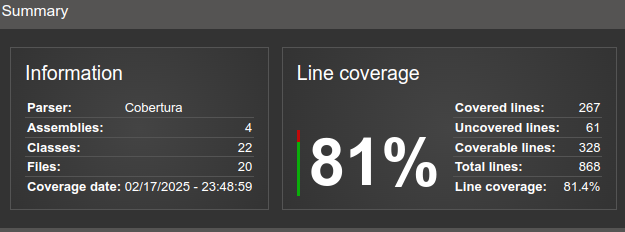

# SnackTech - Produtos 

Este é um projeto desenvolvido em .NET, utilizando arquitetura limpa. A aplicação é um serviço que se comunica com um banco de dados SQL Server. O projeto está configurado para ser executado em contêineres Docker, facilitando a implantação e escalabilidade.

O projeto utiliza tecnologias modernas e práticas de desenvolvimento ágil para garantir um alto nível de qualidade e eficiência.

## Tecnologias Utilizadas

-  **C#**: Linguagem de programação utilizada para desenvolver o projeto.
-  **SQL Server**: Sistema de gerenciamento de banco de dados utilizado.
-  **Swagger**: Plataforma utilizada para documentação da API.
-  **Docker**: Plataforma utilizada para conteinerizar a aplicação.
-  Kubernetes: Plataforma de orquestração de containers para escalabilidade.

### Pré-requisitos

Antes de rodar o serviço de produtos SnackTech, certifique-se de que você possui os seguintes pré-requisitos:

- **.NET SDK**: O projeto foi desenvolvido com o .NET SDK 8. Instale a versão necessária para garantir a compatibilidade com o código.
- **Docker**: O projeto utiliza Docker para contêinerizar a aplicação e o banco de dados. Instale o Docker Desktop para Windows ou Mac, ou configure o Docker Engine para Linux. O Docker Compose também é necessário para orquestrar os containers.
- **SQL Server (Opcional)**: O projeto configura e gerencia uma instância do SQL Server dentro de um container Docker. Sendo assim, a instalação do SQL Server é opcional.
- **Kubernetes**: A aplicação é implantada em um cluster Kubernetes. Certifique-se de ter o Kubernetes instalado e configurado. Se estiver utilizando o Docker Desktop, verifique se a opção de Kubernetes está habilitada.

## Cobertura de testes automatizados

## Equipe

* Adriano de Melo Costa. Email: adriano.dmcosta@gmail.com
* Rafael Duarte Gervásio da Silva. Email: rafael.dgs.1993@gmail.com
* Guilherme Felipe de Souza. Email: gui240799@outlook.com
* Dayvid Ribeiro Correia. Email: dayvidrc@gmail.com

